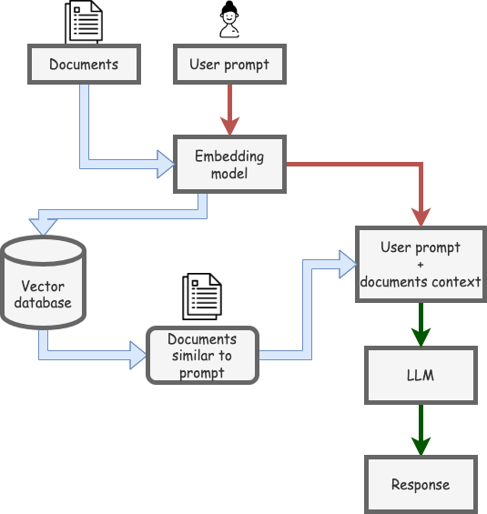

# Tutorials for RAG usage with an LLM locally or in Google Colab

Simple RAG tutorials that can be run locally with an LLM or using Google Colab (only Pro version).

These notebooks can be executed in local or in Google Colab. 
Either way, you have to install Ollama to run it.



# Tutorials

* [Extracting details from a file (PDF) using RAG](./example_rag.ipynb) <a target="_blank" href="https://colab.research.google.com/github/sergiopaniego/RAG_local_tutorial/blob/main/example_rag.ipynb">
  
</a>

* [Extracting details from a YouTube video using RAG](./youtube_rag.ipynb) <a target="_blank" href="https://colab.research.google.com/github/sergiopaniego/RAG_local_tutorial/blob/main/youtube_rag.ipynb">
  
</a>

* [Extracting details from an audio using RAG](./whisper_rag.ipynb) <a target="_blank" href="https://colab.research.google.com/github/sergiopaniego/RAG_local_tutorial/blob/main/whisper_rag.ipynb">
  
</a>

* [Extracting details from a GitHub repo using RAG](./github_repo_rag.ipynb) <a target="_blank" href="https://colab.research.google.com/github/sergiopaniego/RAG_local_tutorial/blob/main/github_repo_rag.ipynb">
  
</a>

# Technologies used

For this tutorials, we use LangChain, LlamaIndex and HuggingFace for generating the RAG application code, Ollama for serving the LLM model and a Jupyter or Google Colab notebook.

<p align="center">
  
  
  
  
  
  
</p>


# Intructions to run the example locally

* Download and install Ollama: 

Go to this URL and install it: https://ollama.com/download

* Pull the LLM model. In this case, llama3:

```
ollama pull llama3
```

More details about llama3 in the [official release blog](https://llama.meta.com/llama3/) and in [Ollama documentation](https://ollama.com/library/llama3).

# Intructions to run the example using Google Colab (Pro account needed)

* Install Ollama from the command line:

(Press the button on the bottom-left part of the notebook to open a Terminal)

```
curl -fsSL https://ollama.com/install.sh | sh
```

* Pull the LLM model. In this case, llama3

```
ollama serve & ollama pull llama3
```

* Serve the model locally so the code can access it.

```
ollama serve & ollama run llama3
```


If an error is raised related to docarray, refer to this solution: https://stackoverflow.com/questions/76880224/error-using-using-docarrayinmemorysearch-in-langchain-could-not-import-docarray


